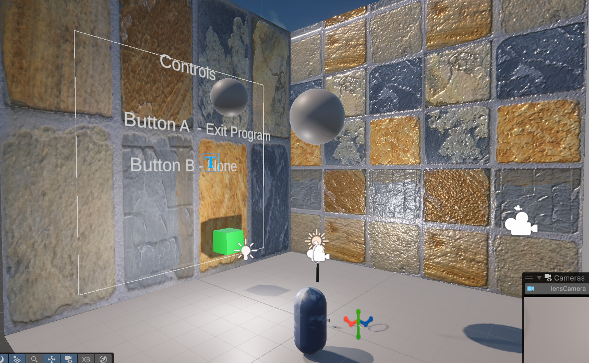

# HW2 — The Scope and Grabbing

**Student:** Prakash Karkee  
**Unity Version:** Unity 6.2.x (6000.2.9f1)  
**XR:** OpenXR + XR Interaction Toolkit  
**Headset Tested:**  Meta Quest 3 (Quest Link / Air Link)

---

## GitHub Repository
https://github.com/prakashkarkee/XR_Project_HW2_scope

## Environment View

---

## Features to Test

### 1) Magnifying Lens (Scope)
- The magnifying lens can be **grabbed**.
- Looking through the lens shows a **magnified view**.

### 2) Hidden Object (Green Cube)
- The green cube is **invisible normally**.
- The green cube becomes **visible through the lens**.

### 3) Combined 2-Hand Grab (CapsulePlay)
- Combined **translation** from both controllers.
- Combined **rotation** from both controllers.
- Rotation occurs around the **manipulating controller / midpoint**.
- **Double rotation** (Extra Credit): press **R** to toggle.

---

## How to Run
1. Unzip the submission folder named **Build**.
2. Run: **XR_HW2.exe**
3. Put on the headset and ensure the **OpenXR runtime** is active.

---

## Build Contents Included
- `XR_HW2.exe`
- `XR_HW2_Data/` (folder)
- `MonoBleedingEdge/` (folder)
- `UnityPlayer.dll`

---

## Notes / Special Instructions
- Two-hand grabbing is implemented on **CapsulePlay** (sky material) in the scene.
- The magnifying lens uses a **RenderTexture (LensRT)** rendered by **LensCamera**.
- If the lens appears black from one side, a **back-facing lens plane** is included to ensure visibility.

---

## Controls
- **Grab:** Controller **Grip** (default XRI binding)
- **Double Rotation Toggle (EC):** Keyboard **R**
- **Lighting / Environment Toggle:** Keyboard **Spacebar**
- **Exit:** Controller **A** button

---

## Demo Videos
- `XR_HW2 - prakscene - Windows, Mac, Linux - Unity 6.2 (6000.2.9f1) _DX11_ 2026-02-14 23-39-39.mp4`
- `XR_HW2 - prakscene - Windows, Mac, Linux - Unity 6.2 (6000.2.9f1) _DX11_ 2026-02-14 23-46-56.mp4`
